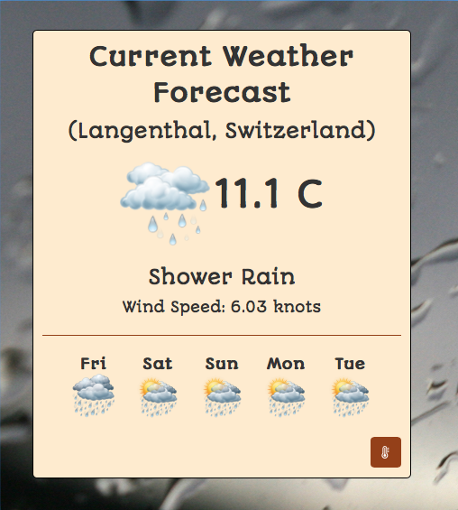

# Current Weather

The Weather application obtains the current weather at your location.  It provides the following features:

- Obtains your location via GPS or IP address if GPS is not available.
- Displays the current weather information
- Changes the background image depending on the current weather conditions.

## Free Code Camp

This project is part of the course work for the [Front End Development Program](https://www.freecodecamp.org/challenges/claim-your-front-end-development-certificate).

## Screen Captures

## Image Attribution

zurich weather - Thomas8047

Clouds - Quinn Dombrowski

Clear sky - Ilya

Snow - Stephane Mignon

Rain - a.dombrowski

Drizzle - Anne Worner

Thumderstorm - Tobias Franz
